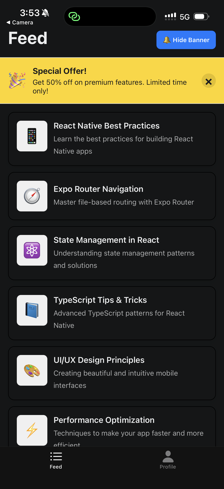
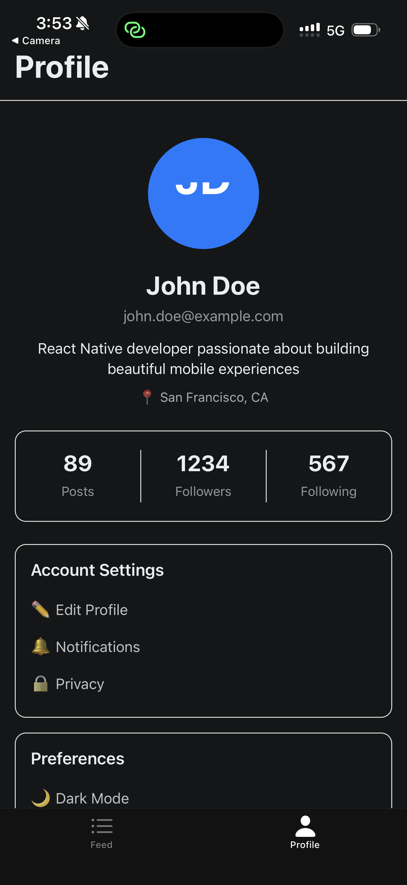

# React Native Starter Architecture 🚀

A production-ready React Native + TypeScript starter app with comprehensive architecture including navigation, state management, feature flags, error handling, and unit testing.

## 📸 Demo Screenshots

<p align="center">
  
  &nbsp;&nbsp;&nbsp;
  
</p>

<p align="center">
  <em>Feed Screen with promotional banner</em>
  &nbsp;&nbsp;&nbsp;&nbsp;&nbsp;&nbsp;&nbsp;&nbsp;&nbsp;&nbsp;&nbsp;&nbsp;&nbsp;&nbsp;&nbsp;&nbsp;&nbsp;&nbsp;&nbsp;&nbsp;&nbsp;&nbsp;&nbsp;
  <em>Profile Screen with user details</em>
</p>

## 📋 Table of Contentsct Native Starter Architecture 🚀

A production-ready React Native + TypeScript starter app with comprehensive architecture including navigation, state management, feature flags, error handling, and unit testing.

## � Table of Contents

- [Tech Stack](#tech-stack)
- [Architecture Overview](#architecture-overview)
- [Getting Started](#getting-started)
- [Running the App](#running-the-app)
- [Running Tests](#running-tests)
- [Project Structure](#project-structure)
- [Key Features](#key-features)
- [Documentation](#documentation)

## 🛠 Tech Stack

- **Framework**: React Native 0.81.5 with Expo SDK ~54.0.23
- **Language**: TypeScript ~5.9.2 (strict mode)
- **Navigation**: Expo Router ~6.0.14 (file-based routing)
- **State Management**: Redux Toolkit 2.10.1 with RTK Query
- **Testing**: Jest + React Native Testing Library
- **React Version**: 19.1.0

## 🏗 Architecture Overview

This starter implements a scalable mobile app architecture with:

1. **Navigation** - Two screens (Feed, Profile) using Expo Router tabs
2. **Data Layer** - Redux Toolkit Query for API calls with mock data
3. **Feature Flags** - Redux-based feature toggle system
4. **Error & Logging** - Comprehensive Logger service + ErrorBoundary
5. **Unit Testing** - 6 comprehensive tests for FeedScreen

## 🚀 Getting Started

### Prerequisites

- Node.js (v16 or higher)
- npm or yarn
- iOS Simulator (Mac only) or Android Emulator

### Installation

1. **Clone the repository**
   ```bash
   git clone <repository-url>
   cd southworks-tech-assessment-lead-react-native
   ```

2. **Install dependencies**
   ```bash
   npm install
   ```

## 📱 Running the App

### Start the development server

```bash
npm start
# or
npx expo start
```

### Run on specific platform

```bash
# iOS Simulator (Mac only)
npm run ios

# Android Emulator
npm run android

# Web browser
npm run web
```

### Development Options

In the Expo developer tools, you can:
- Press `i` - Open iOS simulator
- Press `a` - Open Android emulator
- Press `w` - Open in web browser
- Press `r` - Reload app
- Press `m` - Toggle menu

## 🧪 Running Tests

### Run all tests

```bash
npm test
```

### Run tests in watch mode

```bash
npm run test:watch
```

### Run tests with coverage report

```bash
npm run test:coverage
```

### Test Results

```
PASS  __tests__/FeedScreen.test.tsx
  FeedScreen
    ✓ renders loading state when data is being fetched
    ✓ renders feed items successfully when data is loaded
    ✓ renders error message when data fetching fails
    ✓ renders promotional banner when feature flag is enabled
    ✓ renders Feed screen header with title
    ✓ renders correct number of feed items

Test Suites: 1 passed, 1 total
Tests:       6 passed, 6 total
Snapshots:   0 total
```

**Coverage**: 81.48% for FeedScreen component

## 📁 Project Structure

```
├── app/                          # Expo Router app directory
│   ├── _layout.tsx              # Root layout with ErrorBoundary & Redux
│   ├── modal.tsx                # Modal screen example
│   └── (tabs)/                  # Tab navigation group
│       ├── _layout.tsx          # Tab layout configuration
│       ├── index.tsx            # Feed screen (main)
│       └── profile.tsx          # Profile screen
├── components/                   # Reusable components
│   ├── ErrorBoundary.tsx        # React error boundary
│   ├── themed-text.tsx          # Themed text component
│   ├── themed-view.tsx          # Themed view component
│   └── ui/                      # UI components
├── store/                        # Redux state management
│   ├── index.ts                 # Store configuration
│   ├── api/                     # RTK Query API slices
│   │   ├── feedApi.ts           # Feed data API
│   │   └── profileApi.ts        # Profile data API
│   └── slices/                  # Redux slices
│       └── featureFlagsSlice.ts # Feature flags state
├── services/                     # App services
│   └── Logger.ts                # Logging service
├── hooks/                        # Custom React hooks
│   ├── use-color-scheme.ts      # Color scheme hook
│   └── use-theme-color.ts       # Theme color hook
├── constants/                    # App constants
│   └── theme.ts                 # Theme configuration
├── __tests__/                    # Test files
│   ├── test-utils.tsx           # Test utilities
│   └── FeedScreen.test.tsx      # FeedScreen tests
├── jest.config.json             # Jest configuration
├── jest.setup.ts                # Jest setup & mocks
└── tsconfig.json                # TypeScript configuration
```

## ✨ Key Features

### 1. Navigation (Expo Router)

File-based routing with tab navigation:
- **Feed Screen** (`app/(tabs)/index.tsx`) - Main content feed
- **Profile Screen** (`app/(tabs)/profile.tsx`) - User profile

### 2. Data Layer (Redux Toolkit Query)

**API Endpoints**:
- `useGetFeedQuery()` - Fetch feed items
- `useGetFeedItemQuery(id)` - Fetch single feed item
- `useGetProfileQuery()` - Fetch user profile
- `useUpdateProfileMutation()` - Update user profile

**Features**:
- Automatic caching (60 seconds default)
- Automatic refetching on focus/reconnect
- Loading & error states
- Mock data with 500ms simulated delay

### 3. Feature Flags

Toggle features dynamically using Redux:

```typescript
// Get feature flag state
const showBanner = useSelector(selectShowPromotionalBanner);

// Toggle a feature flag
dispatch(toggleFlag('showPromotionalBanner'));
```

**Available Flags**:
- `showPromotionalBanner` - Show/hide promotional banner (default: true)
- `enableDarkMode` - Enable dark mode (default: false)
- `enableNotifications` - Enable notifications (default: false)

### 4. Error Handling & Logging

**ErrorBoundary**: Catches React errors and displays fallback UI

**Logger Service**:
```typescript
Logger.info('User action', { action: 'button_click' });
Logger.error('API Error', { endpoint: '/feed' });
Logger.logEvent('screen_view', { screen: 'Feed' });
```

### 5. Unit Testing

Comprehensive test suite using React Native Testing Library:
- ✅ Loading states
- ✅ Success states
- ✅ Error handling
- ✅ Feature flag integration
- ✅ UI rendering
- ✅ Data integrity

## 🎯 Quick Start Guide

1. **Install dependencies**: `npm install`
2. **Start the app**: `npm start`
3. **Run tests**: `npm test`
4. **Toggle feature flag**: Tap "Hide Banner" in Feed screen
5. **View logs**: Check console for Logger output

## 🔧 Configuration

### Theme Customization

Edit `constants/theme.ts` to customize colors:

```typescript
export const Colors = {
  light: {
    text: '#11181C',
    background: '#fff',
    // ...
  },
  dark: {
    text: '#ECEDEE',
    background: '#151718',
    // ...
  },
};
```

## 🤝 Contributing

1. Fork the repository
2. Create a feature branch (`git checkout -b feature/amazing-feature`)
3. Commit your changes (`git commit -m 'Add amazing feature'`)
4. Push to the branch (`git push origin feature/amazing-feature`)
5. Open a Pull Request

## 📝 License

This project is licensed under the MIT License.

## 📚 Learn More

- [Expo Documentation](https://docs.expo.dev/)
- [React Native Documentation](https://reactnative.dev/)
- [Redux Toolkit Documentation](https://redux-toolkit.js.org/)
- [Expo Router Documentation](https://docs.expo.dev/router/introduction/)
- [React Testing Library](https://testing-library.com/docs/react-native-testing-library/intro/)

## 🎉 Acknowledgments

Built with:
- [Expo](https://expo.dev)
- [React Native](https://reactnative.dev)
- [Redux Toolkit](https://redux-toolkit.js.org)
- [React Native Testing Library](https://testing-library.com)

---

**Made with ❤️ for Southworks Technical Assessment**
